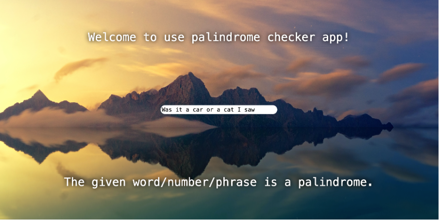

# Palindrome checker app (TypeScript version)

This is a palindrome checker app done on a course called TypeScript at Business College Helsinki. You can give a number, word or phrase and it tells you if it is a palindrome or not.

# Visuals

# Other information

Check the React version from here:

- [Palindrome checker app](https://github.com/satuhalinen/Databases_and_data_structures/tree/main/palindrome_checker_app)
